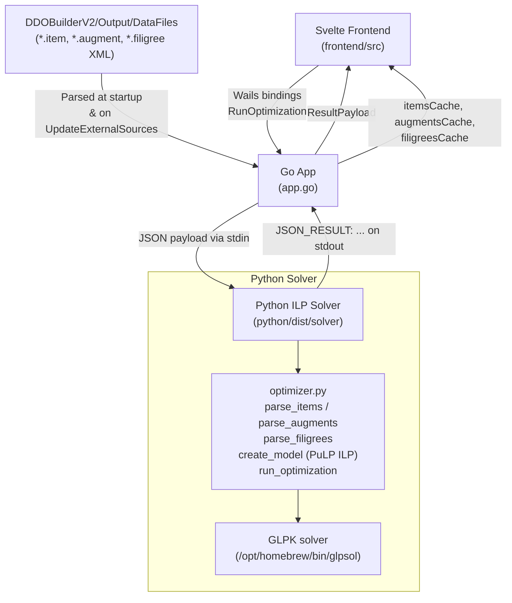

# DDO Gearset Optimizer — Engineering Reference

> Technical documentation for developers. Covers architecture, data flow, key structs, solver logic, and build instructions.

---

## Table of Contents

1. [Architecture Overview](#architecture-overview)
2. [Directory Structure](#directory-structure)
3. [Data Flow](#data-flow)
4. [Go Backend (`app.go`)](#go-backend-appgo)
5. [Python Solver](#python-solver)
6. [Svelte Frontend](#svelte-frontend)
7. [`.ddogearset` File Schema](#ddogearset-file-schema)
8. [Build & Run](#build--run)
9. [Adding New Stats or Effects](#adding-new-stats-or-effects)

---

## Architecture Overview



The Wails framework bridges the Go backend and the Svelte frontend. The Python binary is embedded in the Go binary at compile time via `//go:embed` and extracted to a temp file on startup.

---

## Directory Structure

```
goGearset/
├── app.go                    # Wails App struct, OptimizationPayload, RunOptimization
├── main.go                   # Wails entry point
├── wails.json                # Wails project config
│
├── frontend/
│   └── src/
│       ├── App.svelte        # Root component, tab routing
│       ├── lib/
│       │   ├── store.ts      # Svelte writable stores (configStore, resultStore, ...)
│       │   └── components/
│       │       └── domain/
│       │           ├── JobConfigurationForm.svelte   # Auto Solver tab
│       │           ├── GearsetEditor.svelte          # Item/augment editor tab
│       │           ├── FiligreeEditor.svelte         # Filigree editor tab
│       │           ├── Summary.svelte                # Breakdown + save/load
│       │           └── StatusConsole.svelte          # Log output panel
│       └── wailsjs/go/main/  # Auto-generated Wails TS bindings
│
├── python/
│   ├── solver.py             # Entry point: reads stdin JSON, calls optimizer, prints JSON_RESULT
│   ├── optimizer.py          # Core: item/augment/filigree parsing + PuLP ILP model
│   ├── parser.py             # Quest/expansion XML parsing helper
│   ├── dist/solver           # Compiled PyInstaller binary (embedded into Go binary)
│   └── tests/                # Python unit tests
│
├── internal/
│   ├── models/models.go      # Go XML struct definitions (XMLItem, XMLAugment, XMLFiligree)
│   └── services/
│       ├── parser.go         # Go-side XML parsers for items/augments/filigrees
│       └── enrichment.go     # Wiki URL injection, pack mapping, raid flag tagging
│
├── docs/
│   ├── USAGE.md              # End-user guide
│   ├── ENGINEERING.md        # This file
│   └── plans/
│       └── retrospective.md  # Phase-by-phase retrospective
│
└── scripts/
    └── update_data.go        # CLI tool for one-off data refresh
```

---

## Data Flow

### Full Optimization Run

```
1. User fills JobConfigurationForm → $configStore updated
2. User clicks "Run Optimization"
3. JobConfigurationForm.handleOptimize() calls Wails binding:
       RunOptimization($configStore)   →  app.go: RunOptimization(payload)
4. Go: serializes payload to JSON, writes to solver binary stdin
5. Python solver.py:
       a. Reads JSON from stdin
       b. Calls optimizer.parse_items(), parse_augments(), parse_filigrees()
       c. Calls optimizer.run_optimization() → create_model() → PuLP ILP solve
       d. Extracts solution, computes allEffects + activeSets
       e. Prints: JSON_RESULT:{...json...}
6. Go: scans stdout for JSON_RESULT: prefix, parses ResultPayload
7. Go: returns ResultPayload to frontend
8. Frontend: $resultStore = result; switches to Gearset Editor tab
```

### Calculate-Only Flow (Manual Stat Check)

Same as above but with `calculate_only: true` in the payload. The solver:
- Locks `required_slots` to only slots that have items in `pre_equipped`
- Skips re-solving empty slots
- Simply evaluates effects/set bonuses for the locked configuration

---

## Go Backend (`app.go`)

### `OptimizationPayload` struct

```go
type OptimizationPayload struct {
    GearsetName                string              `json:"gearset_name"`
    MaxLevels                  []int               `json:"max_levels"`       // [34] = solve for ML ≤ 34
    BuildType                  string              `json:"build_type"`       // "Melee"|"Ranged"|"Caster"|"Tank"
    WeaponStyle                string              `json:"weapon_style"`     // "Two Weapon Fighting"|"Bow"|...
    Swashbuckling              bool                `json:"swashbuckling"`
    OffhandStyle               string              `json:"offhand_style"`    // "Orb"|"Buckler"|"Runearm"|"Empty"
    CasterSpellpowers          []string            `json:"caster_spellpowers"` // ["Fire","Force",...]
    CasterSchools              []string            `json:"caster_schools"`     // ["Evocation",...]
    StatPriorities             map[string]int      `json:"stat_priorities"`  // {"Melee Power": 100, "PRR": 60}
    ArmorRestriction           string              `json:"armor_restriction"` // "Light"|"Heavy"|"Any"
    ReservedMinorArtifactSlot  string              `json:"reserved_minor_artifact_slot"` // "Ring"|"Trinket"
    MinorArtifactFiligreeSlots int                 `json:"minor_artifact_filigree_slots"` // 1-5
    ExcludeGemOfManyFacets     bool                `json:"exclude_gem_of_many_facets"`
    RunearmUse                 bool                `json:"runearm_use"`
    ExcludedPacks              []string            `json:"excluded_packs"` // ["Sharn","Ravenloft"]
    RaidItemLimit              int                 `json:"raid_item_limit"` // 0=none, -1=unlimited
    IsDinoArtifact             bool                `json:"is_dino_artifact"`
    OutputFilename             string              `json:"output_filename"` // legacy, unused by solver
    PreEquipped                map[string]string   `json:"pre_equipped"`    // {"Helmet":"Item Name"}
    PreFilledAugments          map[string][]string `json:"pre_filled_augments"` // {"ItemName|0":["Augment"]}
    PreFilledFiligrees         map[string][]string `json:"pre_filled_filigrees"` // {"weapon":["..."],"artifact":["..."]}
    CalculateOnly              bool                `json:"calculate_only"`
}
```

### `ResultPayload` struct

```go
type ResultPayload struct {
    Success       bool                   `json:"success"`
    TimeTaken     float64                `json:"timeTaken"`
    GearSet       map[string]interface{} `json:"gearSet"`        // {"Helmet":"Item Name", ...}
    RealizedStats map[string]interface{} `json:"realizedStats"`  // {"Melee Power": 250}
    ActiveSets    []string               `json:"activeSets"`     // ["Ravenloft Set (3pc): +5 PRR", ...]
    Filigrees     map[string][]string    `json:"filigrees"`      // {"weapon":["..."],"artifact":["..."]}
    AllEffects    map[string]interface{} `json:"allEffects"`     // {"Melee Power": ["Item A: +20", ...]}
    ErrorMessage  string                 `json:"errorMessage"`
}
```

### Key Methods

| Method | Description |
|---|---|
| `RunOptimization(payload)` | Extracts solver binary to temp, pipes JSON payload to stdin, parses `JSON_RESULT:` from stdout |
| `GetItems(filter)` | Returns filtered `itemsCache` for Gearset Editor dropdowns |
| `GetAugments(color)` | Returns `augmentsCache` filtered by augment slot color |
| `GetFiligrees()` | Returns `filigreesCache` for Filigree Editor |
| `GetItemDetails(name)` | Returns single item from cache by name |
| `UpdateExternalSources()` | Runs `git pull` on DDOBuilderV2 repo, re-parses all data files, hot-reloads all caches |
| `GetLogs()` | Returns internal log ring buffer for StatusConsole |

---

## Python Solver

### Entry Point: `solver.py`

Reads the full JSON payload from stdin, orchestrates parsing and solving:

```python
parsed_data = json.loads(sys.stdin.read())
# Extracts all fields from payload
# Calls optimizer functions
# Writes: print(f"JSON_RESULT:{json.dumps(final_gearset)}")
```

Key fields read from payload: `stat_priorities`, `pre_equipped`, `pre_filled_augments`, `pre_filled_filigrees`, `excluded_packs`, `raid_item_limit`, `calculate_only`, `art_slots`.

### `optimizer.py` — Key Functions

#### `parse_items(base_dir, max_ml, priorities, ...)`
- Globs all `*.item` XML files from `DataFiles/Items/`
- Filters by ML range (29 ≤ ML ≤ max_ml)
- Reads effects, slot eligibility, augment slot colors
- Cross-references `quests_lookup` for raid/expansion flags
- Applies `excluded_packs` filter
- Returns list of item dicts

#### `parse_augments(base_dir, cap, priorities)`
- Globs `*.augment` XML files from `DataFiles/Augments/`
- Normalizes stat names against `priorities` via `normalize_stat_name()`
- Returns list of augment dicts with `{name, color, effects}`

#### `parse_filigrees(base_dir, priorities)`
- Globs `*.filigree` XML files from `DataFiles/FiligreeSets/`
- Builds filigree dicts with `{name, base_name, SetName, effects}`
- Returns `(filigrees_list, sets_dict)`

#### `create_model(items, sets, augments, filigrees, priorities, art_slots, required_slots, ..., calculate_only=False)`

Builds the PuLP ILP model. Decision variables:

| Variable | Type | Meaning |
|---|---|---|
| `x[(item_idx, slot)]` | Binary | Item `i` is equipped in slot `s` |
| `y[(aug_idx, item_idx, color)]` | Binary | Augment `a` is in item `i`'s `color` slot |
| `fw[filigree_idx]` | Binary | Filigree `f` is equipped in weapon |
| `fm[filigree_idx]` | Binary | Filigree `f` is equipped in artifact |
| `w_vars[(set_key, count)]` | Binary | Set `s` has exactly `count` pieces equipped |
| `z[stat]` | Continuous | Realized value of stat (capped if stat has a cap) |

**Constraint categories:**
1. **Slot coverage** — exactly 1 item per required slot
2. **Item uniqueness** — each item used at most once (except rings)
3. **Minor artifact** — exactly 1 minor artifact equipped
4. **Raid limit** — `Σ(raid items) ≤ raid_item_limit`
5. **Augment slot limits** — augments per color ≤ item's physical slots × item_is_equipped
6. **Augment uniqueness** — each augment used at most once globally
7. **Filigree same-item exclusion** — same `base_name` filigree can appear at most once per weapon/artifact
8. **Filigree counts** — `Σfw ≤ 10`, `Σfm ≤ art_slots`
9. **Pre-filled locking** — pre_equipped items are pinned with `x[(i,s)] == 1`, augments/filigrees similarly forced

**`calculate_only` mode adds:**
- Forces slots NOT in `pre_equipped` to be empty (`Σx[s] == 0`)
- Forces `Σy == count(pre_filled_augments)`
- Forces `Σfw == count(weapon_filigrees)`, `Σfm == count(artifact_filigrees)`

#### `run_optimization(items, sets, augments, filigrees, priorities, out_file, cap, art_slots, ..., calculate_only=False)`

Top-level orchestrator:
1. Determines `required_slots` from available items (or from `pre_equipped` if `calculate_only`)
2. Calls `create_model()`
3. Solves with GLPK: `prob.solve(pulp.GLPK_CMD(path="/opt/homebrew/bin/glpsol"))`
4. Extracts solution, calculates `allEffects` and `activeSets`
5. Returns result dict

#### `normalize_stat_name(typ, item, desc, priorities)`

Maps raw XML effect type/item/description strings to a canonical priority stat name. Handles DDO's many aliased stat names (e.g., `physical resistance rating` → `PRR`, `healing amplification` → `HAmp`).

---

## Svelte Frontend

### Stores (`lib/store.ts`)

| Store | Type | Purpose |
|---|---|---|
| `configStore` | `writable<OptimizationPayload>` | All solver parameters; persisted to `.ddogearset` |
| `resultStore` | `writable<ResultPayload \| null>` | Last solve/calculate result; drives Summary and Editor |
| `isOptimizing` | `writable<boolean>` | True while solver binary is running; disables buttons |
| `isParsing` | `writable<boolean>` | True while parsing external data |
| `logsStore` | `writable<string[]>` | Ring buffer of status log messages |
| `currentTab` | `writable<'solver'\|'editor'\|'filigrees'\|'summary'>` | Active tab |

### Components

| Component | Tab | Responsibility |
|---|---|---|
| `JobConfigurationForm.svelte` | Auto Solver | All config fields, stat priorities, Run Optimization button, Update External Sources |
| `GearsetEditor.svelte` | Gearset Editor | Per-slot item selection, augment dropdowns, Calculate Stats button, alternatives panel |
| `FiligreeEditor.svelte` | Filigrees | 10-slot weapon filigree grid, N-slot artifact filigree grid, set-filtered filigree picker |
| `Summary.svelte` | Summary | Priority effects table, all effects list, set bonuses, load/save `.ddogearset` |
| `StatusConsole.svelte` | All | Scrollable log output pulled from Go's `GetLogs()` |

---

## `.ddogearset` File Schema

Version 1.2 (current):

```json
{
  "version": "1.2",
  "gearset_name": "string",
  "saved_at": "ISO8601 timestamp",
  "config": {
    "gearset_name": "string",
    "max_levels": [34],
    "build_type": "Melee|Ranged|Caster|Tank",
    "weapon_style": "string",
    "swashbuckling": false,
    "offhand_style": "string",
    "caster_spellpowers": ["Fire"],
    "caster_schools": ["Evocation"],
    "stat_priorities": {"Melee Power": 100},
    "armor_restriction": "Light",
    "reserved_minor_artifact_slot": "Ring",
    "minor_artifact_filigree_slots": 4,
    "exclude_gem_of_many_facets": false,
    "runearm_use": false,
    "excluded_packs": ["Sharn"],
    "raid_item_limit": 2,
    "is_dino_artifact": false,
    "output_filename": "",
    "pre_equipped": {"Helmet": "Item Name"},
    "pre_filled_augments": {"Item Name|0": ["Augment Name"]},
    "pre_filled_filigrees": {"weapon": ["..."], "artifact": ["..."]}
  },
  "result": {
    "success": true,
    "timeTaken": 45.3,
    "gearSet": {"Helmet": "Item Name"},
    "realizedStats": {"Melee Power": 250},
    "activeSets": ["Set Name (3pc): Effect"],
    "filigrees": {"weapon": ["..."], "artifact": ["..."]},
    "allEffects": {"Melee Power": ["Item A: +20 Enhancement"]}
  }
}
```

> **Backwards compatibility:** The load function also handles v1.1 format (no `gearset_name`/`saved_at` top-level fields) and the legacy format (plain slot map JSON).

---

## Build & Run

### Prerequisites

```bash
# Go
brew install go

# Wails
go install github.com/wailsapp/wails/v2/cmd/wails@latest

# Node.js (for Svelte frontend)
brew install node

# Python + venv
cd /Users/jorgecosgayon/dev/ddo
python3 -m venv venv
source venv/bin/activate
pip install pulp pyinstaller

# GLPK solver
brew install glpk
```

### Compile Python Solver

The Python solver must be compiled into a standalone binary before building the Go app:

```bash
cd goGearset/python
/Users/jorgecosgayon/dev/ddo/venv/bin/pyinstaller --onefile solver.py
# Output: python/dist/solver
```

The Go binary embeds `python/dist/solver` via:
```go
//go:embed python/dist/solver
var solverBinary []byte
```

### Run in Development

```bash
cd goGearset
wails dev
```

Hot-reloads the Svelte frontend. Go backend requires restart on changes to `.go` files.

### Production Build

```bash
wails build
# Output: build/bin/goGearset.app (macOS)
```

### Regenerate Wails Bindings

After changing Go struct fields or method signatures:

```bash
cd goGearset
wails generate module
```

This regenerates `frontend/src/wailsjs/go/models.ts` and the function bindings.

---

## Adding New Stats or Effects

To add a new stat that the optimizer can target:

### 1. Python: `normalize_stat_name()` in `optimizer.py`

Add alias matching logic for the new stat name so raw XML effect strings get mapped to it:

```python
elif p_clean == 'my new stat':
    matches.extend(['new_stat_xml_tag', 'alternate xml name'])
```

### 2. Frontend: Stat Priorities UI

No code change needed — the `stat_priorities` field is a free-form `map[string]int`. Users can type any stat name they want. The Python solver will attempt to match it.

### 3. Optional: Cap the stat

If the stat has a game cap (like PRR), add it to the capping logic in `create_model()`:

```python
CAP_VALUES = {
    ...
    'My New Stat': 200,  # add here
}
```

### 4. Optional: Set bonus effects

If the new stat appears in set bonus XML, it will be picked up automatically by the existing set bonus parsing in `optimizer.py` since it uses the same `normalize_stat_name()` normalization.
